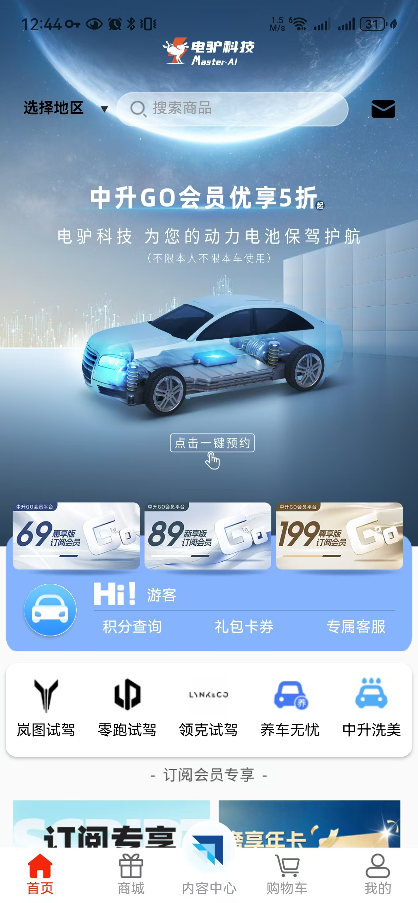
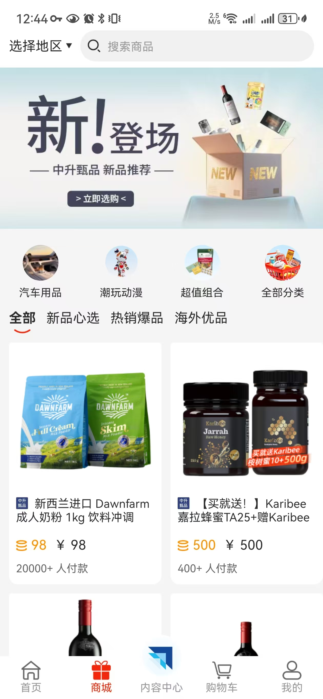
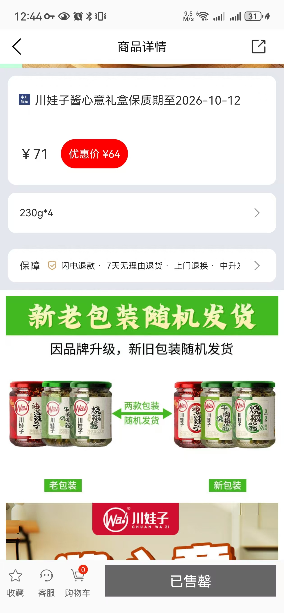

# Zhongsheng GO (中升GO)

> Commercial Android App — Automotive Aftermarket Service Platform  
> Client: Zhongsheng Group | Status: Live in Production

## Overview

Zhongsheng GO is a one-stop digital service platform for “People · Cars · Life”. It provides new energy vehicle battery protection, membership subscriptions, multi-brand test drive booking, car care services, and e-commerce for users of Zhongsheng Group.

**Package:** `com.lzkj.zsgo`  
**Platform:** Android  
**Language:** Kotlin  
**Architecture:** Multi-module componentization (30+ modules) + MVVM

## Key Features

- Membership system (3 tiers) + points / coupons / vouchers
- New energy battery protection with 3D visualization
- Multi-brand test drive appointment
- Full e-commerce mall (cart, order, payment, after-sales)
- Operator one-click login (China Mobile)
- Professional customer service (NetEase Qiyu)
- Full screen adaptation (phone → tablet)

## Technical Highlights

- **30+ modules** clearly separated into shell / business / foundation layers
- Custom Gradle plugins (bytecode instrumentation):
  - Token security injection
  - Global click debouncing
  - Unified Loading management
- TheRouter for inter-module navigation
- MMKV for high-performance storage
- Production-grade payment and logistics integration

## Tech Stack

| Category | Technology |
|----------|------------|
| Language | Kotlin |
| Architecture | MVVM |
| Build | Gradle 7.5 + buildSrc |
| Routing | TheRouter |
| Network | Custom lib_net |
| Storage | MMKV |
| IM / CS | NetEase Yunxin + Qiyu |
| Screen | 20+ breakpoints (sw240–sw961) |
## Screenshots

## Team

Developed and maintained by **HansonForge**.

## Note

This repository is for portfolio demonstration purposes. Sensitive business logic, API keys, and client data have been removed or anonymized.

---

**HansonForge** — Professional Software Development Team  
Contact us for similar Android / e-commerce / membership projects.
